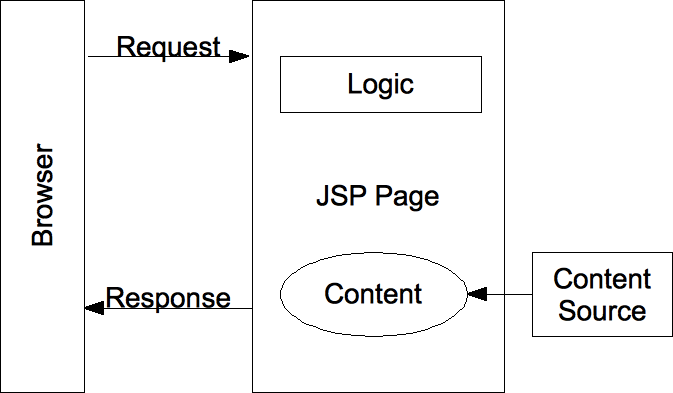

# Server_Basic_Study
Study basic server web development  
Servlet과 JSP 활용에 대한 내용이며 3개의 프로젝트로 구성되어 있다.

---
## 01_Servlet
  
### Servlet
Servlet은 자바를 기반으로 하는 웹 애플리케이션에서 동작하는 서버 사이드 컴포넌트이다. 웹 서버와 웹 애플리케이션 서버(예: Apache Tomcat, Jetty)와 같은 서블릿 컨테이너 내에서 실행되며,  
클라이언트(웹 브라우저)로부터의 HTTP 요청을 처리하고 HTTP 응답을 생성하는 역할을 수행한다.

Servlet의 주요 특징과 역할은 다음과 같다:

1. HTTP 프로토콜 지원: Servlet은 주로 HTTP 프로토콜을 기반으로 동작하며, 클라이언트의 HTTP 요청(GET, POST, PUT, DELETE 등)을 처리한다.  

2. 동적 웹 페이지 생성: Servlet은 동적인 웹 페이지를 생성하는 데 사용됩니다. 클라이언트의 요청에 따라 데이터베이스 조회, 비즈니스 로직 실행 등을 통해 동적으로 웹 페이지의 내용을  
   생성할 수 있다.

3. 생명주기 관리: Servlet은 컨테이너에 의해 생성되고 초기화되며, 클라이언트의 요청을 처리한 후에는 소멸됩니다. 이러한 생명주기 관리를 통해 리소스를 효율적으로 사용할 수 있다.  

4. 멀티 스레드 처리: Servlet은 여러 클라이언트의 동시 요청을 처리하기 위해 멀티 스레드로 동작한다. 각 클라이언트 요청마다 새로운 스레드가 생성되어 처리된다.  

5. HTTP 응답 생성: Servlet은 클라이언트로부터의 요청에 따라 HTTP 응답을 생성한다. 이는 HTML 페이지, JSON 데이터, 파일 다운로드 등의 형태일 수 있다.  

6. 웹 애플리케이션의 핵심 기능: Servlet은 웹 애플리케이션의 핵심 기능을 구현하는 데 사용된다. 웹 프레젠테이션 계층의 컨트롤러 역할을 수행하며, 비즈니스 로직을 포함한 다양한 기능을  
   구현할 수 있다.

Java Servlet API는 Java EE(Java Platform, Enterprise Edition)의 일부로 포함되어 있으며, 서블릿 컨테이너가 설치된 웹 서버 또는 애플리케이션 서버에서 실행되어야 한다. 
Servlet은 매우 널리 사용되는 기술로, 자바를 기반으로 하는 다양한 웹 애플리케이션과 웹 서비스 개발에 활용된다.
> 다시 말해,  
웹서비스를 위한 "자바클래스"를 말하며 자바를 사용하여 웹을 만들기 위해 필요한 기술이다.  
사용자의 요청을 받아 처리하고 그에 해당하는 응답페이지를 만들어 다시 사용자에게 전송하는 역할을 하는 자바 클래스(Controller의 기능)이다.  
웹에서 동적인 페이지를 JAVA로 구현할 수 있게 도와주는 서버측 프로그램 (WAS 서버에서 구동된다)  
JAVA 클래스에서 웹페이지 구현을 위한 HTML이 들어간 구조라고 할 수 있다. (JAVA코드로 HTML구현)  

**doGet과 doPost는 Java Servlet에서 HTTP GET과 POST 요청을 처리하기 위해 사용되는 메서드이다.**

1. doGet():  

doGet() 메서드는 HTTP GET 요청을 처리하는데 사용된다.  
클라이언트가 서버에 데이터를 요청하거나 정보를 얻기 위해 GET 메서드를 사용할 때 호출된다.  
주로 URL 링크 클릭, 폼(form)에서 GET 메서드를 사용하는 경우에 호출된다.  
주요 특징:
> 요청 데이터가 URL의 쿼리 문자열(query string)에 포함되어 전달된다.  
URL 길이에 제한이 있으므로 많은 양의 데이터를 보낼 수 없다.
보안 측면에서 GET 요청은 데이터가 URL에 노출되므로 민감한 정보를 담아서는 안 된다.

2. doPost():

doPost() 메서드는 HTTP POST 요청을 처리하는데 사용된다.  
클라이언트가 서버로 데이터를 제출하고자 할 때 POST 메서드를 사용할 때 호출된다.  
주로 HTML 폼(form)에서 POST 메서드를 사용하는 경우에 호출된다.  
주요 특징:  
> 요청 데이터가 HTTP 요청의 본문(body)에 포함되어 전달된다.  
URL 길이에 제한이 없으므로 대용량 데이터를 보낼 수 있다.  
보안 측면에서 POST 요청은 데이터가 URL에 노출되지 않으므로 GET보다 더 안전하다.  

```java
import javax.servlet.*;
import javax.servlet.http.*;
import java.io.IOException;

public class MyServlet extends HttpServlet {
    protected void doGet(HttpServletRequest request, HttpServletResponse response) throws ServletException, IOException {
        // doGet()에서는 클라이언트의 GET 요청을 처리하는 로직을 구현한다.
        // request.getParameter() 등을 사용하여 요청 데이터를 처리한다.
    }

    protected void doPost(HttpServletRequest request, HttpServletResponse response) throws ServletException, IOException {
        // doPost()에서는 클라이언트의 POST 요청을 처리하는 로직을 구현한다.
        // request.getParameter() 등을 사용하여 요청 데이터를 처리한다.
    }
}
```
Java Servlet에서는 doGet()과 doPost() 외에도 doPut(), doDelete() 등의 메서드도 제공되며, 이들을 활용하여 다양한 HTTP 요청을 처리할 수 있다.   
요청의 종류에 따라 적절한 메서드를 오버라이딩하여 요청을 처리하면 된다.  

### doGet

특징1. Get방식으로 요청하는건 URL의 Header영역에 테이터들을 포함시켜 요청한다.   
-사용자가 입력한 값 (데이터)들이 URL에 노출된다.   
-보안 유지가 불가능하다.   
-즉, 로그인이나 회원가입 같은 경우에 GET방식은 부접합하다.  
		 
특징2. Header영역은 전송하는 길이에 제한이 있다.  
-방대한 뎅터를 담았을 경우 초과된 데이터를 절단되어 넘어간다.  
-즉,게이판 작성 같은 경우 GET방식이 부접합하다.  
		
특징3. 장점이라고 한다면 URL에 데이터가 노출되는 형식이기 때문에 즐겨찾기(북마크)기능을 사용할 수 있다.  
검색기능 같은 경우 GET방식이 접합하다.  

form내의 제출버튼 (submit버튼) 클릭시 태그 속성중 action에 작성된 url로 요청된다(제출)  
즉, Controller(Servlet)을 호출한다고 생각하면 된다.  
Servlet 요청같은 경우 반드시 그 요청값이 현재 웹 애플리케이션의 contextPath(처음지정한 contextRoot)  
뒤에 작성되어야한다.(1_Servlet)  
ex) http://localhost:8888/1_Servlet/test.do  
		
절대경로 방식(/로 시작되는 경우) : localhost:8888뒤에 action에 작성한 값이 붙어지며 요청  
상대경로 방식(문구로 시작하는 경우 : 현재 이페이지가 보여질때에 url경로중 마지막/ 뒤에 붙는다.  
**html**
```html
	 <form action="/1_Servlet/test1.do" method="get"> <!-- 절대경로 방식 -->
	 	<!-- name속성은 서버에 key값으로 넘어가기 때문에 필수로 작성하여야한다. -->
	 	<ul>
			<li>
				키: <input type="range" name="height" min="140" max="200">
			</li>
			<li>
				좋아하는 음식 (모두 고르시오):
				한식<input type="checkbox" name="food" value="한식">
				중식<input type="checkbox" name="food" value="중식">
				일식<input type="checkbox" name="food" value="일식">
				양식<input type="checkbox" name="food" value="양식">
				분식<input type="checkbox" name="food" value="분식">
			</li>
			<li>
				<input type="submit">
				<input type="reset">
			</li>
	 	</ul>
	 </form>
```

GET방식으로 요청했으면 doGet메소드가 호출된다.
첫번째 매개변수인 HttpSevletRequest 에는 요청시 전달된 내용을 갖고 있다
(입력한 값, 요청전속방식, 사용자의 ip등등)
두번째 매개변수인 HttpServletResponse에는 요청 처리 후 응답할때 필요한 객체들이 담겨있다.

요청을 처리하기 위해 요청시 전달된 값(사용자가 입력한 값)들을 뽑아준다.
request 객체의 parameter영역 안에 존재한다. (key-value의 형태로 담겨져 있다)
이때 key는 name속성 value는 value속성값
 
request.getParameter("키값"): (반환타입: String): 무조건 문자열 형으로 반환되기 때문에
												      필요에 의해 형변환을 하여야한다.
request.getParameterValues("키값"): 반환타입: String[] 
							-하나의 key값으로 여러개의 value값을 받을 경우 문자열배 형태로 반환받는다. 
       
**Servlet**  
```java
protected void doGet(HttpServletRequest request, HttpServletResponse response) throws ServletException, IOException {
    //무조건 문자열로 넘어오기 때문에 해당 자료형으로 파싱해야한다.
    double height = Double.parseDouble(request.getParameter("height")); //형변환 파싱 해야함
    String[] foods = request.getParameterValues("food"); //checkbox도 선택안하면 null이 넘어옴

		//지금 얻어온 데이터를 db에 저장하는 작업을 해야한다.(요청처리)
		//보통의 흐름: Service메소드 호출하여 현재 얻어낸 데이터 전달 - dao호출-db작업- 결과 반환.
		
		//위와같은 작업이 진행됐다고 가정하고 사용자가 보게될 응답화면을 구성해보자
		
		//Servlet내에서 응답 화면을 생성하여 보낼것.
		//장점: JAVA코드 내에 작성하기 때문에 반복문이나 조건문, 유용한 메소들을 활용할 수 있다.
		//단점: 복잡하고 혹시라도 html 코드를 수정하고자 할때는 서버를 재실행해서 적용시켜야한다.
		//response객체를 통해서 사용자에거 html(응답화면)전달
		//1)이제부터 전달할 문서형태는 html이고 문자인코딩은 utf-8이라는 것을 지정
		response.setContentType("text/html; charset=UTF-8");
		
		//2)응답하고자하는 사용자(요청했던 사용자)와의 스트림 생성(클라이언트와의 통로)
		PrintWriter out = response.getWriter();

    out.print(height);
    out.print(foods);
}
```

### doPost
특징1. POST 방식으로 요청하는 데이터는 URL의 Body영역에 데이터를 포함시켜 요청한다.  
>-사용자가 입력한 (데이터)들이 URL에 노출되지 않음.  
-보안유지가 가능하다.  
-로그인 또는 회원가입과 같은 개인정보 요청시에는 POST방식이 접합함.  
		
특징2. Body 영역의 전송하는 길이 제한이 없다.  
> -게시글 작성같이 많은 데이터가 넘어가야할때는 POST방식이 접합하다.  
		
특징3. 최대 요청받는 시간이 존재하여 페이지 요청, 기다리는 시간이 있다.  
		
특징4. url주속에 기존 데이터가 담겨있지 않으니 즐겨찾기 불가하다.

**html**
```html
	<form action="/1_Servlet/test2.do" method="post">
		<!-- 절대경로 방식 -->
		<!-- name속성은 서버에 key값으로 넘어가기 때문에 필수로 작성하여야한다. -->
		<ul>
			<li>이름: <input type="text" name="name">
			</li>
			<li>성별: 남자<input type="radio" name="gender" value="M">
				여자<input type="radio" name="gender" value="F">
			</li>
			<li>사는 도시: <select name="city">
					<option>서울</option>
					<option>경기</option>
					<option>인천</option>
					<option>강원</option>
			</select>
			</li>
			<li>키: <input type="range" name="height" min="140" max="200">
			</li>
			<li>좋아하는 음식 (모두 고르시오): 한식<input type="checkbox" name="food"
				value="한식"> 중식<input type="checkbox" name="food" value="중식">
				일식<input type="checkbox" name="food" value="일식"> 양식<input
				type="checkbox" name="food" value="양식"> 분식<input
				type="checkbox" name="food" value="분식">
			</li>
			<li><input type="submit"> <input type="reset"></li>
		</ul>
	</form>
```
**Servlet**
```java
	protected void doPost(HttpServletRequest request, HttpServletResponse response) throws ServletException, IOException {
//		doGet(request, response);
		//POST요청시 값을 추출하기 전에 UTF-8로 인코딩처리를 하여야한다.
		//GET 방식처럼 url에 담겨오지 않기 때문에 기본 인코딩 설정이 ISO-8859-1로 되어있기 때문에
		request.setCharacterEncoding("UTF-8");
		
		String name = request.getParameter("name");
		String gender = request.getParameter("gender");
		String city = request.getParameter("city");
		double height = Double.parseDouble(request.getParameter("height"));
		String [] foods = request.getParameterValues("food");
		
		System.out.println("이름: " + name);
		System.out.println("성별: " + gender);
		System.out.println("도시: " + city);
		System.out.println("키: " + height);
		//String.join("구분자",배열);: 구분자를 이용하여 배열을 하나의 문자열로 바꿔주는 메소드
		System.out.println("좋아하는 음식: " + String.join(",", foods));
		
		//처리 과정 진행 후
		
		//응답페이지 만들기
		//순수Servlet: Java코드 내에 html코드를 작성하는 방법
		//JSP(Java Server Page): html내에 java코드를 기술하는 방법
		
		//응답할 작업을 jsp페이지에게 위임해보자
		//응답페이지에서 보여줘야할 데이터를 전달하면서
		//이때 전달할 데이터는 request객체에 담아서 보내야한다.
		//request객체의 attribute 영역에 키와 벨류 세트로 담아서 전달한다.
		
//		request.setAttribute("키", "벨류");
		
		request.setAttribute("name", name);
		request.setAttribute("gender", gender);
		request.setAttribute("city", city);
		request.setAttribute("height", height);
		request.setAttribute("foods", foods);
		
		//작업을 위임하기 위해 필요한 객체: RequestDispatcher
		//1)응답하고자하는 뷰(jsp)를 선택하며 생성한다.
		RequestDispatcher view = request.getRequestDispatcher("views/responsePage.jsp");
		
		//forward(): 응답페이지에게 위임하기 
		view.forward(request, response);
	}
```

---
## 02_JSP
  
### JSP(Java Server Page)
JSP(JavaServer Pages)는 서버 측에서 동적인 웹 페이지를 생성하기 위해 사용되는 Java 기반의 웹 프로그래밍 기술이다. JSP는 HTML 코드에 Java 코드를 포함시킴으로써 동적으로 웹 페이지  
를 생성할 수 있다. JSP는 Java Servlet 기술을 기반으로 하며, Java 코드를 보다 쉽고 편리하게 웹 페이지에 삽입할 수 있도록 지원한다.  
> JSP의 가장 큰 장접은 Servlet에서는 비지니스 로직 (컨트롤러 역할)에만 집중하고  
프레젠테이션 로직처리(응답화면을 만들어내는 뷰 역할)은 JSP에서집중하게 분리할 수 있는 것.  

JSP의 주요 특징과 역할은 다음과 같다:  

동적 웹 페이지 생성: JSP를 사용하여 Java 코드를 HTML 문서에 삽입하여 동적으로 웹 페이지를 생성할 수 있다. 이를 통해 사용자 요청이나 데이터베이스의 상태 등에 따라 웹 페이지의   
내용이 변경될 수 있다.  

자바 코드 삽입: JSP 파일 내에 <% %> 기호를 사용하여 Java 코드를 삽입할 수 있다. 이를 통해 데이터 처리, 반복문, 조건문 등의 비즈니스 로직을 쉽게 구현할 수 있다.   

서블릿으로 변환: JSP 파일은 서블릿으로 변환되어 웹 애플리케이션의 컨테이너(예: Apache Tomcat)에서 실행된다. 이러한 변환 과정을 통해 JSP는 서블릿 기술과 밀접한 관련이 있다.    

JSP 태그 라이브러리 (JSTL): JSP 태그 라이브러리는 JSP 내에서 자주 사용되는 공통 작업을 단순화하는 기능을 제공한다. 반복문, 조건문, 데이터베이스 접근 등을 더 쉽게 처리할 수 있도록  
도와준다.  

웹 애플리케이션의 View 역할: 일반적으로 MVC 아키텍처에서 JSP는 웹 애플리케이션의 View(프레젠테이션 레이어) 역할을 수행한다. 즉, 클라이언트의 요청을 처리한 컨트롤러(서블릿)로부터  
데이터를 받아서 웹 페이지를 동적으로 생성하여 클라이언트에게 응답으로 보여준다.
```java
<%@ page language="java" contentType="text/html; charset=UTF-8" pageEncoding="UTF-8" %>
<!DOCTYPE html>
<html>
<head>
    <title>My JSP Page</title>
</head>
<body>
    <h1>Hello, <%= request.getParameter("name") %>!</h1>
</body>
</html>
```
위의 코드에서 <%= request.getParameter("name") %> 부분은 JSP 코드로, 사용자의 이름을 동적으로 출력하는 코드이다. 이 페이지는 클라이언트가 name 파라미터를 전달하면 해당 이름을 
출력한다.

### 스크립틀릿
스크립틀릿(Scriptlet)은 JSP(JavaServer Pages)에서 Java 코드를 삽입하여 동적으로 웹 페이지를 생성하는 데 사용되는 기능이다. 스크립틀릿은 JSP 페이지 내에서 <% %> 태그를 사용하여  
Java 코드를 포함시킨다. 이를 통해 데이터 처리, 반복문, 조건문 등의 비즈니스 로직을 JSP 페이지에서 쉽게 구현할 수 있다.    

스크립틀릿을 사용하여 JSP 페이지 내에 Java 코드를 삽입할 수 있다. 일반적으로 스크립틀릿 내에서 변수를 정의하고 초기화하거나, 데이터 처리, 데이터베이스 조회, 반복문 등을 수행할 수   
있다.  
```java
<%@ page language="java" contentType="text/html; charset=UTF-8" pageEncoding="UTF-8" %>
<!DOCTYPE html>
<html>
  <head>
      <title>My JSP Page</title>
  </head>
  <body>
      <%-- 변수 정의 및 초기화 --%>
      <% int num1 = 10; %>
      <% int num2 = 20; %>
  
      <%-- 데이터 처리 및 출력 --%>
      <% int sum = num1 + num2; %>
      <h1>Sum: <%= sum %></h1>
  
      <%-- 반복문 --%>
      <% for (int i = 1; i <= 5; i++) { %>
          <p>Iteration <%= i %></p>
      <% } %>

      <ol>
    		<li>
    			선언문: &lt;%! %&gt; <br>
    			멤버 변수와 메소드를 선언하기 위해 사용
    		</li>
    		<li>
    			스크립틀릿: &lt;% %&gt; <br>
    			JSP에서 자바코드를 기술하기 위한 제일 기본적인 표현법
    		</li>
    		<li>
    			표현식 (출력식): &lt;%= %&gt; <br>
    			자바에서 작성한 값 또는 메소드를 호출하기 위해 (출력) 사용
    		</li>
    	</ol>
  </body>
</html>
```

### page 지시어
현재의 jsp페이지를 처리하는데 필요한 각종 속성을 기술하는 부분  
>language: 사용할 스크립트 언어 유형을 지정  
contentType: 웹 브라우저가 받아볼 해당 페이지의 형식, 인코딩 방식 지정  
pageEncoding: jsp파일에 기록된 자바코드의 인코딩 방식 지정  
import: 자바의 import와 같은  
errorPage: 해당 jsp상에서 오류가 발생했을 경우 보여줄 오류페이지 경로 지정  

```html
<%@ page language="java" contentType="text/html; charset=UTF-8"
    pageEncoding="UTF-8" import="java.util.Date" errorPage="error500.jsp"%>
<%@ page import="java.util.ArrayList, java.util.Scanner" %>
```

### include 지시어
jsp 파일에 또 다른 jsp를 포함시키고자 할때 사용하는 지시어  
tablib 지시어: JSP 기능을 좀 더 확장할 수 있는 인자로 추가적인 라이브러리를 등록하는 구문  
```html
<%@ include file="01_ScriptingElement.jsp" %>
<%@ include file="dateprint.jsp" %>
```

---
## jspProject

HttpServletRequest 객체와 HttpServletResponse 객체  
-request : 서버로 요청할 때의 정보들이 담겨있다 (요청시 전달값, 요청 전송 방식 등등)  
-response : 요청에 대해 응답에 필요한 객체  

**doGet()과 doPost()차이점**  
doGet()과 doPost()은 Java Servlet에서 HTTP GET과 POST 요청을 처리하기 위해 사용되는 두 가지 메서드입니다. 이 두 메서드는 서버 측에서 클라이언트의 요청을 처리하는데 사용되며, 
주요한 차이점은 다음과 같다:  

1. HTTP 메서드:  
   - doGet(): doGet() 메서드는 HTTP GET 요청을 처리하는데 사용된다. 즉, 클라이언트가 웹 서버로 데이터를 요청하거나 정보를 얻기 위해 GET 메서드를 사용하는 경우에 호출된다.  
   - doPost(): doPost() 메서드는 HTTP POST 요청을 처리하는데 사용된다. 즉, 클라이언트가 웹 서버로 데이터를 제출하고자 할 때 POST 메서드를 사용하는 경우에 호출된다.  

2. 데이터 전달:  
   - doGet(): doGet() 메서드는 요청 데이터를 URL의 쿼리 문자열(query string)에 포함하여 전달한다. 쿼리 문자열은 URL 끝에 '?' 기호와 함께 데이터가 전달되는 형태이다. 
   - doPost(): doPost() 메서드는 요청 데이터를 HTTP 요청의 본문(body)에 포함하여 전달한다. 따라서 데이터가 URL에 노출되지 않아서 GET보다는 POST 요청이 보안적으로 더 안전하다다.  
     또한 POST 요청은 URL에 데이터를 포함하지 않기 때문에 보다 대용량의 데이터를 전송할 수 있다.  

3. 사용 예시:  
   - doGet(): 주로 웹 페이지의 조회, 검색, 상세 정보 조회 등에 사용된다. 예를 들어, 게시판의 글 목록을 조회하거나, 제품의 상세 정보를 보여주는 기능에 사용될 수 있다.  
   - doPost(): 주로 웹 페이지의 데이터 제출, 로그인, 회원가입 등에 사용된다. 예를 들어, 사용자가 로그인 정보를 입력하고 제출하거나, 회원가입 양식을 작성하고 제출하는 기능에 사용될  
     수 있다.

두 메서드는 각각 GET과 POST 요청에 대해 적절한 역할을 수행하기 위해 사용되며, 개발자는 요청의 종류와 필요에 따라 적절한 메서드를 오버라이딩하여 요청을 처리하면 된다. Java Servlet  
에서는 doGet()과 doPost() 외에도 doPut(), doDelete() 등의 메서드도 제공되며, 이들을 활용하여 다양한 HTTP 요청을 처리할 수 있다.  

**데이터 전달하기**  
응답페이지에 전달할 값이 있다면 값을 어딘가엔 담아서 전달해야한다. (이때 담아줄수있는 내장객체 4가지)  
-servlet scope  
1)application : application에 담은 데이터는 웹 애플리케이션 전역에서 꺼내쓸수 있다.  
2)session : session에 담은 데이터는 모든 jsp와 servlet에서 꺼내쓸수 있다.  
				한번 담은 데이터는 직접 지우기 전까지, 서버가 멈추기 전까지, 브라우저가 종료되기 전까지는 사용가능하다.  
3)request : request에 담은 데이터 해당 request를 포워딩한 응답 jsp에서만 꺼내쓸 수 있다.  
4)page : 해당 jsp 페이지에서만 꺼내쓸 수 있음    
 
공통적으로 데이터를 담고자 한다면  
-setAttribute("키", "밸류");   
데이터를 꺼내고자 한다면  
-getAttribute("키");  
데이터를 지우고자 한다면  
-removeAttribute("키");  

**응답하기**  
응답 방식 2가지   
1.위임 (포워딩) - 요청을 유지한채로 위임하는 방법 (url에 기존 주소가 남아있음)    
RequestDispatcher view = request.getRequestDispatcher("응답페이지경로");  
view.forward(request, response);  
			
2.재요청 (리다이렉트) - 새 페이지를 보여줘(url에 기존 주소 남아있지 않음)  
response.sendRedirect("경로);  
response.sendRedirect("/jsp");//localhost:8888/jsp  
```java
protected void doPost(HttpServletRequest request, HttpServletResponse response) throws ServletException, IOException {
    //1)POST요청일 경우 전달값에 한글이 포함되어있다면 encoding설정을 해야한다.
		request.setCharacterEncoding("UTF-8");
		//2)요청시 전달한 데이터를 추출하기
		String userId = request.getParameter("userId");
		String userPwd = request.getParameter("userPwd");
		
		//조회해온 Member객체(loginUser)
		Member loginUser = new MemberService().loginMember(userId,userPwd);

		if(loginUser == null) { //로그인 실패 (에러 페이지로 응답해보기)
			//보내고자 하는 에러페이지에 에러 메세지를 포워딩
			request.setAttribute("errorMsg", "로그인에 실패하였습니다.");
			//응답페이지 jsp에 위임할때 필요한 객체 (RequestDispatcher)
			RequestDispatcher view = request.getRequestDispatcher("views/common/errorPage.jsp");
			//포워딩(위임) - 해당 경로로 view 화면은 보여지지만 url은 변경되지 않는다 (맨처음 요청했을때의 url이 남아있음)
			view.forward(request, response);
		}else {//로그인 성공 - index페이지로 돌아가기
			//로그인한 회원의 정보를 계속 가지고 다닐것이기 때문에 session에 담아준다
			
			//session에 담으려면 Session 객체를 먼저 가지고 와야한다.
			HttpSession session = request.getSession();
			
			//조회된 유저 정보객체를 담아주기
			session.setAttribute("loginUser", loginUser);
			session.setAttribute("alertMsg", "성공적으로 로그인 되었습니다.");

	    String before = request.getHeader("Referer");
      response.sendRedirect(before);
    }
}
```

### C R U D
Create(insert) Read(select) Update Delete
		
**회원서비스**  
로그인 : R  
회원가입 : C  
정보변경 : U  
회원탈퇴 : U or D  
마이페이지 : R  
		
**게시판**
게시글 조회 : R  
게시글 작성 : C  
게시글 수정 : U  
게시글 삭제 : U or D  
		
댓글 작성 : C  
댓글 조회 : R  
댓글 수정 : U  
댓글 삭제 : U or D  

~~더 자세한 이야기는 내 블로그에서:[말만 하는 개발자](https://mongkevin.tistory.com/)~~
